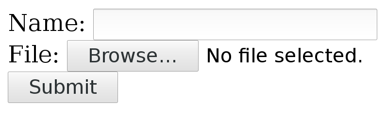

# HTTP multipart formposts

# HTTP multipart formposts(多部份表格)

A multipart formpost is what an HTTP client sends when an HTML form is
submitted with *enctype* set to "multipart/form-data". It is an HTTP POST
request sent with the request body specially formatted as a series of "parts",
separated with MIME boundaries.

multipart formposts 是 HTTP 客户端在提交 HTML表 单时将 *enctype* 设置为 "multipart/form-data" 时发送的内容。它是一个 HTTP POST 请求，发送时请求体被专门格式化为一系列“部分”，用 MIME 边界分隔。

An example piece of HTML would look like this:

HTML 的一个示例如下所示：

~~~
<form action="submit.cgi" method="post" enctype="multipart/form-data">
  Name: <input type="text" name="person"> 
  File: <input type="file" name="secret"> 
  <input type="submit" value="Submit">
</form>
~~~
Which could look something like this in a web browser:

在 web 浏览器中看起来如下图所示：

A user can fill in text in the 'Name' field and by pressing the 'Browse'
button a local file can be selected that will be uploaded when 'Submit' is
pressed.

用户可以在 `Name` 字段中填写文本，按下 `Browse` 按钮，可以选择本地文件，当按下 `Sumbit` 按钮时将上传该文件。

## Sending such a form with curl

## 用 curl 发送这样的表格

With curl, you add each separate multipart with one `-F` (or `--form`) flag
and you then continue and add one -F for every input field in the form that
you want to send.

使用 curl，你可以为每个独立的部分添加一个`-F`（或`--form`）标志，也可以为要发送的表单中的每个输入字段都添加一个`-F`。

The above small example form has two parts, one named 'person' that is a plain
text field and one named 'secret' that is a file.

上面的小示例表单有两部分，一部分名为 `person`，是纯文本字段，另一部分名为 `secret`，是文件。
 
Send your data to that form like this:

发送这个表单数据的命令，如下所示：

    curl -F person=anonymous -F secret=@file.txt http://example.com/submit.cgi

## The HTTP this generates

## 由此生成的 HTTP

The **action** specifies where the POST is sent. **method** says it is a POST
and **enctype** tells us it is a multipart formpost.

**action** 指定 POST 要发送到的地方，**method** 表示它是一个 POST 请求，**enctype** 表示它是一个 multipart formposts（多部分表格）。

With the fields filled in as shown above, curl generates and sends these HTTP
request headers to the host example.com:

通过如上所示填写字段，curl 生成这些 HTTP 请求头并将其发送到主机示例：

    POST /submit.cgi HTTP/1.1
    Host: example.com
    User-Agent: curl/7.46.0
    Accept: */*
    Content-Length: 313
    Expect: 100-continue
    Content-Type: multipart/form-data; boundary=------------------------d74496d66958873e

**Content-Length**, of course, tells the server how much data to expect. This
example's 313 bytes is really small.

**Content-Length** 告诉服务器有多少数据。这个示例中的 313 字节非常小。

The **Expect** header is explained in the [Expect 100
continue](post/expect100.md) chapter.

**Expect** 头在[Expect 100 continue](post/expect100.md)一章中有解释。

The **Content-Type** header is a bit special. It tells that this is a
multipart formpost and then it sets the "boundary" string. The boundary string
is a line of characters with a bunch of random digits somewhere in it, that
serves as a separator between the different parts of the form that will be
submitted. The particular boundary you see in this example has the random part
`d74496d66958873e` but you will, of course, get something different when you
run curl (or when you submit such a form with a browser).

**Content-Type** 头有点特殊。它告诉你这是一个多部分formpost，然后设置 "boundary" 字符串。边界字符串是一行字符，其中某处有一组随机数字，用作将提交的表单不同部分之间的分隔符。你在本例中看到的特定边界具有随机部分 `d74496d66958873e`，但当你运行 curl（或使用浏览器提交此类表单）时，你可能会得到不同的结果。

So after that initial set of headers follows the request body

因此，在最初的一组头之后，将跟随请求主体

    --------------------------d74496d66958873e
    Content-Disposition: form-data; name="person"

    anonymous
    --------------------------d74496d66958873e
    Content-Disposition: form-data; name="secret"; filename="file.txt"
    Content-Type: text/plain

    contents of the file
    --------------------------d74496d66958873e--

Here you clearly see the two parts sent, separated with the boundary
strings. Each part starts with one or more headers describing the individual
part with its name and possibly some more details. Then after the part's
headers come the actual data of the part, without any sort of encoding.

在这里，你可以清楚地看到被发送的两个部分，通过分割字符串分隔。每个部分都以一个或多个头开始，并且包含它的名称和更多细节。然后在这部分的头之后是它的实际数据，没有任何编码。

The last boundary string has two extra dashes `--` appended to signal the end.

最后一个边界字符串额外有两个破折号 `--`，用来表示结束。

## Content-Type

## 内容类型(Content-Type)

POSTing with curl's -F option will make it include a default Content-Type
header in its request, as shown in the above example. This says
`multipart/form-data` and then specifies the MIME boundary string. That
content-type is the default for multipart formposts but you can, of course,
still modify that for your own commands and if you do, curl is clever enough
to still append the boundary magic to the replaced header. You cannot really
alter the boundary string, since curl needs that for producing the POST
stream.

使用 curl 的 -F 选项发布将使其在请求中包含一个默认内容类型头，如上面的示例所示。这表示 `multipart/formdata`，然后指定 MIME 边界字符串。该内容类型是 multipart formposts（多部分表单）的默认内容类型，当然你仍然可以按自己的要求修改该内容类型，如果你这样做，curl 仍然可以将边界字符串附加到替换的头中。你不能去更改边界字符串，因为 curl 需要它来生成 POST 流。

To replace the header, use `-H` like this:

如果要替换头，像这样使用 `-H` 选项：

    curl -F 'name=Dan' -H 'Content-Type: multipart/magic' https://example.com

## Converting a web form

## 转换 web 表单

There are a few different ways to figure out how to write a curl command line
to submit a multipart form as seen in HTML.

有几种不同的方法可以解决如何编写 curl 命令行以提交 HTML 中的多部分表单的问题。

1. Save the HTML locally, run `nc` locally to listen on a chosen port number,
   change the `action` URL to submit the POST to your local `nc`
   instance. Submit the form and watch how `nc` shows it. Then translate into
   a curl command line.

2. Use the "development tools" in your favorite browser and inspect the POST
   request in the network tab after you have submitted it. Then convert that
   HTTP data to a curl command line. Unfortunately, the [copy as
   curl](../usingcurl/copyas.md) feature in the browsers usually do not actually
   do multipart formposts particularly well.

3. Inspect the source HTML and convert into a curl command line directly from
   that.

1. 在本地保存 HTML，在本地运行 `nc` 以侦听所选端口号，更改 `action` URL 以将 POST 请求提交到本地 `nc` 实例。提交表单并观察 `nc` 如何显示。然后转换为 curl 命令行。

2. 使用你喜爱的浏览器中的开发工具，并在提交后在网络选项卡中检查 POST 请求。然后将该 HTTP 数据转换为 curl 命令行。不幸的是，浏览器中的[copy as curl](../usingcurl/copyas.md) 功能实际上并不能很好地处理 multipart formposts。

3. 阅读 HTML 源码并直接将其转换为 curl 命令行。

## From `<form>` to -F

## 从 `<form>` 到-F

In a `<form>` that uses `enctype="multipart/form-data"`, the first step is to
find the `action=` property as that tells the target for the POST. You need to
convert that into a full URL for your curl command line.

在 `<form>` 使用 `enctype="multipart/form-data"` 时，第一步是找到 `action=` 属性，该属性是 POST 请求的目标。你需要将其转换完整的 URL 然后提供给 curl 命令行用。

An example action looks like this:

示例操作如下所示：

    <form action="submit.cgi" method="post" enctype="multipart/form-data">

If the form is found in a web page hosted on a URL like for example
`https://example.com/user/login` the `action=submit.cgi` is a relative path
within the same "directory" as the form itself. The full URL to submit this
form thus becomes `https://example.com/user/submit.cgi`. That is the URL to
use in the curl command line.

如果表单是在 `https://example.com/user/login` 这个 URL 对应的网页里的，它里面的 `action=submit.cgi` 是一个相对路径。对应的完整 URL 就是 `https://example.com/user/submit.cgi` 。这个完整 URL 就可以应用在 curl 命令中。

Next, you must identify every `<input>` tag used within the form, including
the ones that are marked as "hidden". Hidden just means that they are not
shown in the web page, but they should still be sent in the POST.

接下来，你必须识别表单中使用的每个 `<input>` 标记，包括标记为 `hidden` 。隐藏只是标志着它们不会显示在网页中，但仍会在 POST 请求中发送。

For every `<input>` in the form there should be a corresponding `-F` in the
command line.

对于表单中的每个 `<input>`，命令行中都应该有一个对应的 `-F` 选项。

### text input

### 文本输入

A regular tag using type "text" in the style like

通常使用 "text" 作为文本输入的常规标记，如

    <input type="text" name="person">

should then set the field name with content like this:

然后像这样设置字段名：

    curl -F "person=Mr Smith" https://example.com/

### file input

### 文件输入

When the input type is set to a "file", like in:

当输入类型设置为 "file" 时，如：

    <input type="file" name="image">

You provide a file for this part by specifying the file name and use `@` and
the path to the file to include:

通过使用 `@` 和要包含的文件路径来指定文件名，就可以提供对应的文件：

    curl -F image=@funnycat.gif https://example.com/

### hidden input

### 隐藏输入

A common technique to pass on state from a form is to set a number of
`<input>` tags as `type="hidden"`. This is basically the same thing as an
already filled in form field, so you convert this to a command line by using
the name and value. For example:

用表单传递状态是一种常见的技术，他是通过将大量的 `<input>` 设置为 `type="hidden"` 来实现。它其余已填充的表单字段基本相同，因此也可以使用名称和值将其转换为命令行。例如：

    <input type="hidden" name="username" value="bob123">

This is converted like for the normal text field, and here you know what the
content should be:

可以像普通 "text" 字段一样进行转换的，例如：

    curl -F "username=bob123" https://example.com/

### All fields at once

### 一次完成所有字段

If we toy with the idea that all the three different `<input>` tags showed in
the examples above were used in the same `<form>`, then a complete curl
command line to send, including the correct URL as extracted above, would look
like:

如果我们想将上面示例中显示的所有三个不同的 `<input>` 都放到同一个 `<form>` 中使用，那么包括了上面提取的完整 URL 的 curl 命令行，如下所示：

    curl -F "person=Mr Smith" -F image=@funnycat.gif -F "username=bob123" \
    https://example.com/user/submit.cgi
